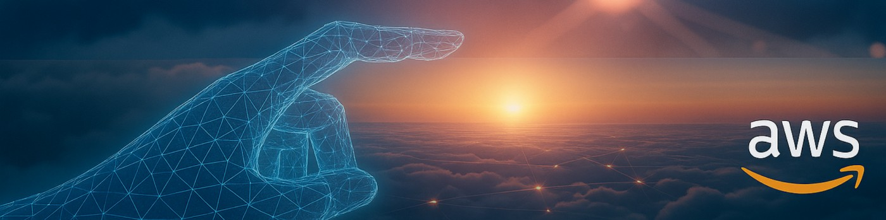

<div align="center">
    
</div>

<div align="center">

<h2>👋 Hey, I'm Riyaz Bhattarai</h2>

<h3>AWS & Terraform Developer &nbsp;·&nbsp; AWS Certified Cloud Practitioner &nbsp;·&nbsp; Pursuing AWS SAA</h3>

<p>
  
  
  
</p>

<p>
  <a href="mailto:reeeyaz.job@gmail.com">
    
  </a>
  &nbsp;
  <a href="https://tinyurl.com/etwrayek">
    
  </a>
  &nbsp;
  
</p>

</div>

---

I design and automate AWS infrastructure — building scalable, secure, and cost-efficient cloud environments using **Terraform and IaC from the ground up**.

My background bridges cloud architecture and web development — from WordPress sites serving **50K+ monthly users** to fully automated AWS deployments. Currently advancing toward **AWS Solutions Architect Associate** and deepening Terraform expertise through real-world projects.

```
🔭 Currently:  Building with Terraform | Preparing for AWS SAA
🌱 Learning:   Advanced Terraform | AWS networking & architecture patterns  
💼 Open to:    Cloud Engineer | DevOps Engineer | Infrastructure Engineer roles
📍 Based in:   Calgary, AB — open to remote
```

---

## 🚀 Featured Projects

### 🏗️ Resume-as-Code Website (AWS + Terraform)
> **Terraform · S3 · CloudFront · Route 53 · ACM · IAM · VPC**

- Fully automated static site deployed with **Terraform** — consistent, repeatable infrastructure
- Enforced HTTPS via **Route 53 + ACM**; private S3 access via **CloudFront OAC**
- Follows **AWS Well-Architected Framework** principles across all 5 pillars

### ⚡ Auto-Scaling Cost-Saver Lab (AWS + Terraform)
> **EC2 · Auto Scaling · ALB · CloudWatch**

- Elastic architecture that **scales on demand** using ALB + Auto Scaling groups
- Simulated CPU spikes to validate scale-out triggers via **CloudWatch alarms**
- Automatic scale-in post-load — reduces infrastructure cost with zero manual effort

### 🤖 Serverless Mood-Bot
> **AWS Lambda · API Gateway · CloudWatch · Vertex AI**

- Event-driven serverless app with **zero idle compute cost**
- Integrated **Vertex AI** for intelligent response generation
- Fully observable via **CloudWatch** metrics and logs

---

## 🛠️ Tech Stack
**Cloud & Infrastructure as Code (IaC)**


**AWS Services**


**Other**


---


##  GitHub Stats

<div align="center">
  
  
</div>

<br>

<div align="center">
  
</div>


---

## 🏅 Certifications

| | Certification | Issuer | Valid |
|:---:|---|---|---|
| ☁️ | **AWS Certified Cloud Practitioner** | Amazon Web Services | Jan 2026 – Jan 2029 |
| 🤖 | **Prompt Design in Vertex AI** | Google | Sep 2024 |
| 📊 | **Google Analytics IQ (GAIQ)** | Google Digital Academy | Nov 2024 |
| 🎓 | **AWS Solutions Architect Associate** | Amazon Web Services | 🔄 In Progress |

---

<div align="center">

[](mailto:reeeyaz.job@gmail.com)
&nbsp;
[](https://tinyurl.com/etwrayek)


</div>
